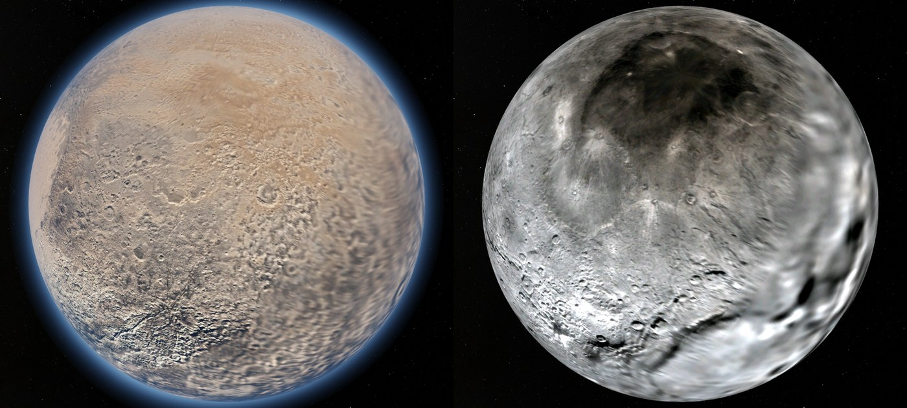
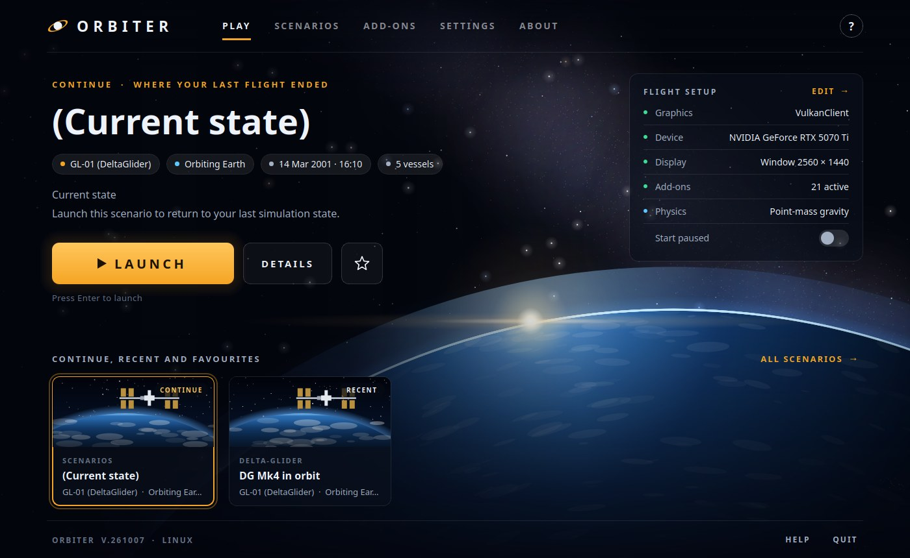
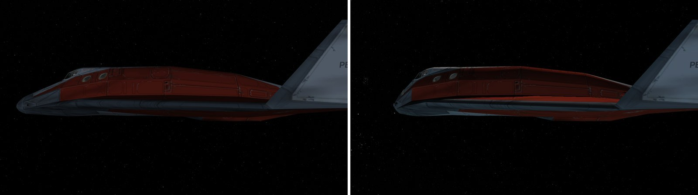

# Orbiter 2027 Space Flight Simulator — native Linux port+

Orbiter is a spaceflight simulator based on Newtonian mechanics. Its playground
is our solar system with many of its major bodies – the sun, planets and moons.
You take control of a spacecraft – either historic, hypothetical, or purely
science fiction. Orbiter is unlike most commercial computer games with a space
theme – there are no predefined missions to complete (except the ones you set
yourself), no aliens to destroy and no goods to trade. Instead, you will get a
pretty good idea about what is involved in real space flight – how to plan an
ascent into orbit, how to rendezvous with a space station, or how to fly to
another planet. It is more difficult, but also more of a challenge. Some people
get hooked, others get bored. Finding out for yourself is easy – simply give it
a try. Orbiter is free, so you don’t need to invest more than a bit of your
spare time.

This tree is the Linux-only code of a line-by-line port of [orbitersim/orbiter](https://github.com/orbitersim/orbiter)
(commits in `UPSTREAM`, via [racerx2/orbiter64-Linux](https://github.com/racerx2/orbiter64-Linux)) to native Linux: no Wine, no DXVK, graphics on Vulkan 1.3,
windows and dialogs on Qt 6, sound on PipeWire. It holds no Windows code; Orbiter for
Windows is [orbitersim/orbiter](https://github.com/orbitersim/orbiter).

## What's new since the Windows version

### Planets and moons



*Pluto, with its thin nitrogen atmosphere and blue haze, and Charon.*

- **The Pluto system**: Pluto, Charon, Nix, Hydra, Kerberos and Styx, which Orbiter never had.
- **New ephemeris modules** for Phobos, Deimos, Miranda, Ariel, Umbriel, Titania, Oberon and Triton (Windows has
  them only as 32-bit binaries), and better orbits for Hyperion, Proteus, Nereid and Vesta.
- **Spin axes and prime meridians** from the IAU rotation model.
- **Every planet and moon on the tile renderer**, with new maps for Mercury, Saturn, Uranus, Triton, Pluto and
  Charon. The textures are a separate download
  ([Orbiter-linux-orbital-bodies-textures](https://github.com/racerx2/Orbiter-linux-orbital-bodies-textures));
  the Launchpad offers to download and install the missing ones.
- **Measured atmospheres** for every body that has one, so drag and aerobraking use real densities.

### Launchpad skins



Change how the Launchpad looks without changing what it does. Pick a skin under **Extra > Launchpad skin**:

- **Dark**: a dark style sheet for the classic Launchpad.
- **Horizon** (above) and **Planetary Defense**: complete new launchers, made as Qt Designer forms.
- **Your own**: copy a skin, or make a new layout of the stock Launchpad, and edit it in Qt Designer.
  See [Skins/README.md](./Skins/README.md).

Ctrl+Shift+L always brings back the classic Launchpad.

### Collisions and damage



*A Delta Glider before (left) and after (right) a 70 m/s head-on crash.*

An add-on that makes ships collide with each other and with base buildings:

- Colliders follow each ship's real mesh, so cargo bays stay open.
- Docked and attached stacks respond as one body, and every impact conserves momentum.
- Dents form where the ships hit, sized by the crash energy. A ship that absorbs more than 1 kJ per kg is
  destroyed (it loses thrust when the Damage model option is on).

Turn it on in the Launchpad's **Modules** tab (Collision). Settings are in `Config/Collision.cfg`.

### Multiplayer


**Under construction – stay tuned.**

## License

Orbiter is now published as an Open Source project under the MIT License (see
[LICENSE](./LICENSE) file for details).

The graphics engine (OVP/VulkanClient, ported from D3D9Client) is dual licensed under GPL v3 and LGPL v3,
see [GPL](./OVP/VulkanClient/GPL.txt) and [LGPL](./OVP/VulkanClient/LGPL.txt).

## Installation
Hardware requirements needed by Orbiter:
|  | Minimum requirements | Recommended requirements |
| ---- | ---- | ---- |
| RAM: | 500 MB | 2 GB |
| CPU: | Dual Core |  |
| GPU: | Vulkan 1.3 | Vulkan 1.3 |
| Disk: | 5 GB of free space | 10 GB of free space (80 GB if you want hi-res textures) |

The Vulkan driver also needs the extensions listed in [COMPILE.md](./COMPILE.md).

Get the port repository from github
```bash
git clone https://github.com/racerx2/orbiter-linux.git
```

To configure and build you need CMake 3.28 or later, Ninja and GCC with C++20.
See [COMPILE.md](./COMPILE.md) for details on building Orbiter.

## Planet textures

The Orbiter git repository does not include most of the planetary texture files
required for running Orbiter.
You need to install those separately. The easiest way to do so is by installing
an [Orbiter](https://github.com/orbitersim/orbiter/releases) release. Optionally
you can also install high-resolution versions of the textures from the Orbiter website.
You should keep the Orbiter installation separate from your Orbiter git
repository.

To configure Orbiter to use the texture installation, set the
ORBITER_PLANET_TEXTURE_INSTALL_DIR entry in CMake. For example, if Orbiter
was installed in `~/Orbiter`, the CMake option should be set to
`~/Orbiter/Textures`.

This path can also be set using ORBITER_PLANET_TEXTURE_INSTALL_DIR environment variable

Alternatively, you can configure the texture directory after building Orbiter
by setting the `PlanetTexDir` entry in `Orbiter.cfg`.

## Help

Help files are located in the Doc subfolder (if you built them with `-DORBITER_MAKE_DOC=ON`).
Orbiter User Manual (Linux).pdf is the main Orbiter user manual.

The in-game help system can be opened via the "Help" button on
the Orbiter Launchpad dialog, or with Alt-F1 while running
Orbiter.

Remaining questions can be posted on the Orbiter user forum at
[orbiter-forum.com](https://www.orbiter-forum.com).
